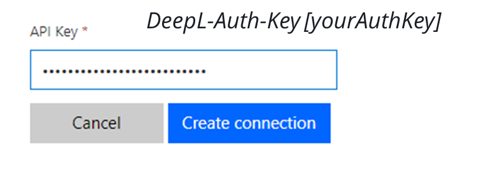
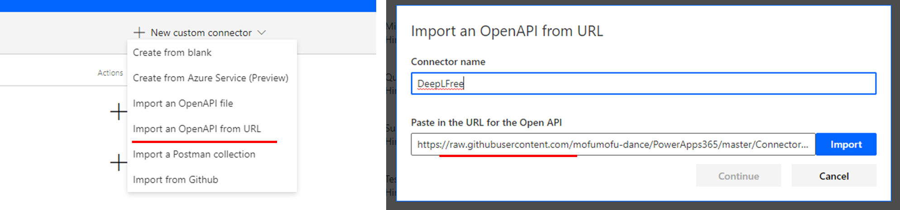

# DeepL

DeepL API provides the world’s best machine translation technology directly into your own flow.

# Prerequisites

You need to sign up DeepL developer account. You can [register](https://www.deepl.com/pro-api?cta=header-pro/) for free upto 500,000 character limit/month or premium (consumption) account.

If you have free DeepL account, use [apiDefinition.free.json](./apiDefinition.free.json), for premium account use [apiDefinition.json](./apiDefinition.json).

# Authentication

API key is provided in your account page. Set API Key as *DeepL-Auth-Key {yourAuthKey}* when create connection.

# Minimal Path to Awesome

* Open list of custom connectors page in your environment, and click "+New custom connector".
* Select "Import an OpenAPI from URL", and input raw url for [Free](https://raw.githubusercontent.com/mofumofu-dance/PowerApps365/master/Connectors/DeepL/apiDefinition.free.json) or [Premium](https://raw.githubusercontent.com/mofumofu-dance/PowerApps365/master/Connectors/DeepL/apiDefinition.json).
* After import connector, set background color and icon.

# Supported Operations

## Translate text

Translate input text from source language (optional) to target language.

Parameter | Description|Required | Type
---|---|---|---
target_lang | The language into which the text should be translated.|Yes | Text
source_lang | Language of the text to be translated.|No | Text
text | Text to be translated. Only UTF8-encoded plain text is supported.|Yes | Text

## Upload document to translate

Upload document to translate. This returns *documentId* and *documentKey* to check status and to download result.
Following extensions are supported.
- "docx" - Microsoft Word Document
- "pptx" - Microsoft PowerPoint Document
- "htm / html" - HTML Document
- "txt" - Plain Text Document

Parameter | Description|Required | Type
---|---|---|---
target_lang | The language into which the text should be translated.|Yes | Text
source_lang | Language of the text to be translated.|No | Text
file | The document file to be translated. |Yes | binary
filename | The name of the uploaded file.|Yes | Text

## Check document translation status
Check the status of the document translation process by specifying *documentId* and *documentKey*.

Parameter | Description|Required | Type
---|---|---|---
document_id | A unique ID assigned to the uploaded document and the requested translation process. |Yes | Text
document_key | The document encryption key that was sent to the client when the document was uploaded to the API.|Yes | Text

## Get document translation result

Once the status of the document translation process is "done", the result can be downloaded by this action.

Parameter | Description|Required | Type
---|---|---|---
document_id | A unique ID assigned to the uploaded document and the requested translation process. |Yes | Text
document_key | The document encryption key that was sent to the client when the document was uploaded to the API.|Yes | Text

## List supported languages

Returns list all supported languages of the API for target and source language.

# Known Issues and Limitations

No issues and limitations are known at this time.

# References

- [DeepL API Doc](https://www.deepl.com/docs-api)
