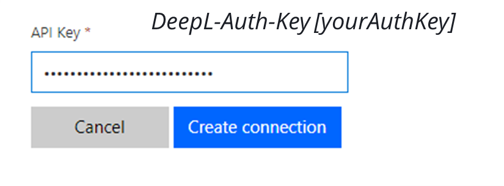

# DeepL

DeepL APIは、世界最高水準の機械翻訳技術をお客様のフローに直接提供します。

# 前提条件

DeepL 開発者アカウントを登録する必要があります。[こちらから登録](https://www.deepl.com/pro-api?cta=header-pro/)することで、50万文字/月までの無料アカウント、またはプレミアム(従量課金)アカウントを取得できます。

DeepL 開発者アカウントの無料版をお持ちの方は [apiDefinition.free.json](./apiDefinition.free.json) を、プレミアムアカウントの方は [apiDefinition.json](./apiDefinition.json) をご利用ください。

# 認証

APIキーはアカウントページで提供されます。接続を行う際には、APIキーを *DeepL-Auth-Key {yourAuthKey}* として設定してください。

# 利用手順

* お使いの環境でカスタムコネクタの一覧ページを開き、「+New custom connector」をクリックします。
* 「Import an OpenAPI from URL」を選択し、[Free](https://raw.githubusercontent.com/mofumofu-dance/PowerApps365/master/Connectors/DeepL/apiDefinition.free.json)または[Premium](https://raw.githubusercontent.com/mofumofu-dance/PowerApps365/master/Connectors/DeepL/apiDefinition.json)のURLを入力してください。
* インポートされたコネクタの、背景色とアイコンを設定します。

# サポートされる操作

## テキストの翻訳

入力されたテキストを、ソース言語(オプション)からターゲット言語に翻訳します。

パラメータ|説明|必須|タイプ
---|---|---|---
target_lang|翻訳先の言語|はい|テキスト
source_lang|翻訳されるテキストの言語|いいえ|テキスト
text|翻訳されるテキスト。UTF8でエンコードされたプレーンテキストのみサポートしています|はい|テキスト

## 翻訳するドキュメントのアップロード

翻訳対象のドキュメントをアップロードします。翻訳状況の確認や翻訳結果のダウンロードのために、*documentId*と*documentKey*が返されます。
以下の拡張子に対応しています。
- docx - Microsoft Word ドキュメント
- pptx - マイクロソフト・パワーポイント・ドキュメント
- htm / html - HTMLドキュメント
- txt - テキスト形式の文書

パラメータ|説明|必須|タイプ
---|---|---|---
target_lang|翻訳先の言語|はい|テキスト
source_lang|翻訳されるテキストの言語|いいえ|テキスト
file|翻訳されるドキュメントファイル|はい|バイナリ
filename|アップロードされたファイルの名前|はい|テキスト

## ドキュメント翻訳状況の確認
*documentId*と*documentKey*を指定して、ドキュメントの翻訳処理の状況を確認します。

パラメータ|説明|必須|タイプ
---|---|---|---
document_id|アップロードされたドキュメントと要求された翻訳プロセスに割り当てられたユニークなIDです。|はい|テキスト
document_key|ドキュメントがAPIにアップロードされた際にクライアントに送信されたドキュメントの暗号化キー|はい|テキスト

## ドキュメント翻訳結果の取得

ドキュメントの翻訳処理のステータスが「完了」になると、このアクションで翻訳結果をダウンロードできます。

パラメータ|説明|必須|タイプ
---|---|---|---
document_id|アップロードされたドキュメントと要求された翻訳プロセスに割り当てられたユニークなIDです。|はい|テキスト
document_key|ドキュメントがAPIにアップロードされた際にクライアントに送信されたドキュメントの暗号化キー|はい|テキスト

## サポートされている言語の一覧

APIでサポートされている全ての言語の一覧を返します。

# 既知の問題点と制限事項

現在のところ、問題や制限はありません。

# 参考文献

- [DeepL API Doc](https://www.deepl.com/docs-api)

このMarkdownもDeepL APIで翻訳しています
