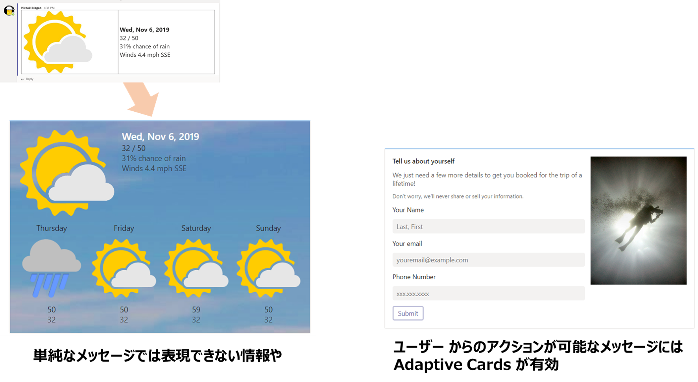
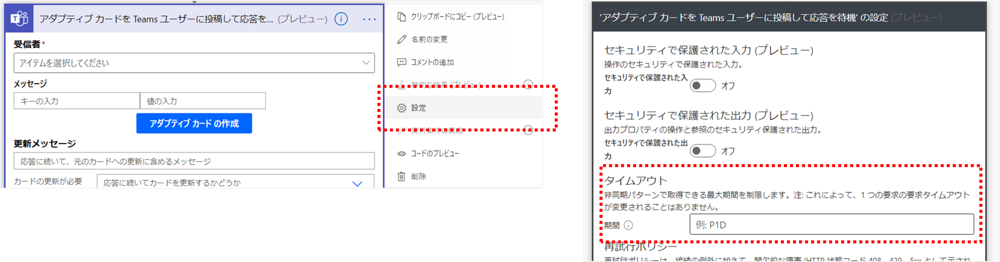

<strong><span style="font-size: 200%; color: blue;">Power Platform 利用者のための</span>

<span style="font-size: 200%; color: blue;">Adaptive Cards 入門</span></strong>


<span style="font-size: 120%; color: gray;text-align:center"> ~ 基礎編 ~</span>

<div style="page-break-before:always"></div>

# 1. Adaptive Cardsとは

Adaptive Cards はプラットフォームに依存しないユーザーインターフェースの構成要素で、JSONでその構造や標示データが記述されるます。

サービスやアプリはこのユーザーインターフェース側とこのJSONをやり取りすることで、それぞれの実行環境に最適化された表示に変換されます。

Adaptive Cards の重要な特徴は、情報量に富んだカードであることと、ユーザーとのインタラクションが可能であることです。
リッチなユーザーインターフェースを簡単に作れるだけでなく、ユーザーがいつも利用している環境上 (アプリ・サービス) でアクションを起こすようなカード (フォームやボタンでの表示切替) が利用できるため、ユーザーへの負担が少ないことがメリットであると考えられます。



現在サポートされているサービスとして、Bot Framework, Microsoft Teams, Outlook, Windows Timeline等がありますが、基本的にはOS, サービスを問わず提供されているライブラリを利用することでAdaptive Cardsを自身のサービス・アプリ上で展開することが可能です。

<table class="table"><caption class="visually-hidden">サービスごとの Adaptive Cards 対応バージョン</caption>
<thead>
<tr>
<th>Platform</th>
<th>Description</th>
<th>Documentation</th>
<th>Version</th>
</tr>
</thead>
<tbody>
<tr>
<td><a href="https://github.com/Microsoft/BotFramework-WebChat" data-linktype="external">Bot Framework Web Chat</a></td>
<td>Embeddable web chat control for the Microsoft Bot Framework</td>
<td><a href="/en-us/adaptive-cards/get-started/bots" data-linktype="absolute-path">Get Started</a></td>
<td>1.2.6 (Web Chat 4.9.2)</td>
</tr>
<tr>
<td><a href="/en-us/outlook/actionable-messages/" data-linktype="absolute-path">Outlook Actionable Messages</a></td>
<td>Attach an actionable message to email</td>
<td><a href="/en-us/outlook/actionable-messages/" data-linktype="absolute-path">Get Started</a></td>
<td>1.0</td>
</tr>
<tr>
<td><a href="https://products.office.com/microsoft-teams/group-chat-software" data-linktype="external">Microsoft Teams</a></td>
<td>Platform that combines workplace chat, meetings, and notes</td>
<td><a href="/en-us/microsoftteams/platform/concepts/cards/cards-reference#adaptive-card" data-linktype="absolute-path">Get Started</a></td>
<td>1.2</td>
</tr>
<tr>
<td><a href="/en-us/cortana/skills/adaptive-cards" data-linktype="absolute-path">Cortana Skills</a></td>
<td>A virtual assistant for Windows 10</td>
<td><a href="/en-us/adaptive-cards/get-started/bots" data-linktype="absolute-path">Get Started</a></td>
<td>1.0</td>
</tr>
<tr>
<td><a href="https://blogs.windows.com/windowsexperience/2017/12/19/announcing-windows-10-insider-preview-build-17063-pc/" data-linktype="external">Windows Timeline</a></td>
<td>A new way to resume past activities you started on this PC, other Windows PCs, and iOS/Android devices.</td>
<td><a href="/en-us/adaptive-cards/get-started/windows" data-linktype="absolute-path">Get Started</a></td>
<td>1.0</td>
</tr>
<tr>
<td><a href="https://www.webex.com/team-collaboration.html" data-linktype="external">Cisco WebEx Teams</a></td>
<td>Webex Teams helps speed up projects, build better relationships, and solve business challenges.</td>
<td><a href="https://developer.webex.com/docs/api/guides/cards" data-linktype="external">Get Started</a></td>
<td>1.2</td>
</tr>
</tbody>
</table>

( 引用元 : https://docs.microsoft.com/en-us/adaptive-cards/resources/partners)


また、最近では Microsoft の各種サービスにおける Adaptive Cards の利用・対応がさらに進んでいます。

現在プレビューで提供されている Microsoft Search の結果表示カスタマイズにも Adaptive Cards が利用されており、検索結果の1件 1件をカードとして表示させることで、ユーザーがより直感的に結果から望みのアイテムを選択できるようになります。

また、Teams/Outlook の領域だけでなく、Adaptive Cards SDKを利用してSharePoint 上のリストデータの表示をカスタマイズする試みや、 Power Apps Component Framework を利用したアプリのカスタマイズにも応用されているなど、プロ開発者の貢献により、さらに活用の場が広がっています。


以降では、ローコードを基本として、Power Platformの利用者を中心にAdaptive Cardsの利用・作成方法、サービスへの送信方法について解説し、Graph API, Templating APIを利用した発展的な内容についても概観していきます。

なお、Adaptive Cards のバージョンは執筆時点の最新 (v1.2)を基本とします。

<div style="page-break-before:always"></div>

# 2. Adaptive Cards デザイナーの利用

Adaptive Cards を作成するには決められた[スキーマ](https://adaptivecards.io/explorer/) (書式) に沿ってJSONを記述する必要があります。
"JSONを記述する" と言うと身構えてしまうかもしれませんが、Adaptive Cards ではウェブで利用できるデザイナーが用意されており、直接JSONを書くことなく、ドラッグ&ドロップや設定値の入力だけでカードを作成することが可能です。

本章ではAdaptive Cards デザイナーを利用してサンプルのカードをカスタマイズする方法や、空のカードから初めて独自のカードを作成する場合の方法を記載します。

なお、後述するTemplating (カードレイアウトとデータの分離) については本章では触れないこととします。

>**[参考]**
>
>Adaptive Cards デザイナーの他に、"Classic Visualizer"が利用できますが、これは作成したJSONから各サービスでの表示をエミュレートするものです。
>すでに機能としては Adaptive Cards デザイナーに内包されているため、本書では利用しません。
>
>https://adaptivecards.io/visualizer/index.html

## 2-1. Adaptive Cards デザイナーの概要

ウェブブラウザーを起動して、以下のURLを表示しましょう。

[https://adaptivecards.io/designer/](https://adaptivecards.io/designer/)

読み込みが完了すると下図のような画面が表示されます。これがAdaptive Cards デザイナーです。

デザイナーの画面は大きく7つの要素で構成されています。


### 各部の役割

本書では、主に①～⑤を利用してカードを作成していきます。

①パレットからカードで利用するパーツを③デザインエリアにドラッグ＆ドロップし、追加したパーツの設定 (表示文字列や選択肢等) を⑤プロパティペインで指定します。

入力後、①ツールバーにある 「Preview mode」 ボタンをクリックして表示を確認し、「Copy Card JSON」 をクリックするか、⑥カードレイアウトエディタのJSONをコピーして利用します。


④の構造ビューは、特に入れ子の構造が正しく反映されているかを確認する際に利用します。

⑥カードレイアウトエディタではカードの構造を記述するJSONがリアルタイムに生成され、またここを変更することでもデザインに反映させることができます。

⑦のサンプルデータエディタは Templating を利用してカードを構成する場合のデータ部分ですが、本書では割愛します。

## 2-2. カードへのパーツ追加
Adaptive Cards に追加可能なパーツには大きくわけて
- データ表示
- レイアウト
- 入力
- アクション

が提供されています。

それぞれを詳細に理解するためには [スキーマ](https://adaptivecards.io/explorer/) を確認する必要がありますが、ここでは代表的なものについて解説します。

### <u>TextBlock</u>
ラベルや一行・複数行テキスト型のデータを表示する際に利用するのがTextBlockです。

**Text** プロパティに表示する文字列を設定します。この中では部分的にMarkdownによる書式付テキストが有効なため、装飾する場合には [こちらのページ](https://docs.microsoft.com/en-us/adaptive-cards/authoring-cards/text-features) を参照してください。

複数行テキストを表示するには **Wrap** プロパティをチェックします。もし最大行数を設定したい場合には **Maximum lines** に行数を設定してください。

その他、**Style** プロパティではフォントサイズや太さ、カラーを指定できます。


また、最近のアップデートで特殊な書式として
```
<at>user@example.com</at>
```
によるユーザーへのメンションが追加されています。 (Teams 限定)

参考 : [Power AutomateからTeamsに@メンション入りメッセージを送る](https://mofumofupower.hatenablog.com/entry/2020/07/10/232856)

### <u>Image</u>
画像表示用のパーツです。
必須の **Url** プロパティに対してインターネット上の画像URLを指定するだけでなく (画像URLを利用する場合には匿名でのアクセスが前提)、画像のdata uriを設定することでも画像を表示できます。

**Style** を "Person" に設定すると画像が丸く切り抜かれるので、
アイコンを表示する場合に有効です。


 Image は画像を表示するだけでなく、アクションを追加することができます。
 例えば画像をクリックしてリンクに遷移するなど、アクション利用して装飾されたカスタムボタンを作ることもできます。

※アクションについては後述

### <u>FactSet</u>
名前からあまりピンとこないかもしれませんが、箇条書きや「設定名 : 設定値」のペアを複数表示するような場合に有効なパーツです。

FactSet には固有の **Facts** というプロパティがあり、 Name - Value のペアを設定します。 いずれも一意である必要はないので、Name に ✓ のような記号を入れて箇条書きにすることもできます。


### <u>Container</u>
Container は複数のパーツを一纏めにするときに有効なパーツです。
背景画像 (**Background image > URL**) を設定できるので、画像の上に文字を表示するような少し凝ったデザインのカードを作成する場合に有効です。


また、生成されるJSONとしても、Container パーツの中 (下位の構造) にパーツを含めることができるので、配列形式のデータを表示する場合も有効です。


### <u>ColumnSet</u>
カードをデザインするときに段組みをしたい場合には、この ColumnSet を使います。

ColumnSet を追加した際には、パーツ右下に表示されるアイコンから、「Add a column」で1つ以上の Column を追加してください。


それぞれの Column には **Layout**プロパティが設定可能で、特に **Width** プロパティを設定することで、任意の割合でカードを分割することができます。

例えば、左側20%にアイコン画像を、右80%に氏名等のプロフィールを書くと、簡単にプロフィールカードを作ることができます。


"RowSet" のような行方向の分割がないので完全ではありませんが、うまく ColumnSet を入れ子にすることで、非常にデザイン性に富んだカードを作成できます。


### <u>Input.Text</u>
入力関連のパーツでは共通して、**Id** プロパティでユーザーの入力情報が取得するため、設定が必須になります。
その他、入力関連のパーツでは、プレースホルダー、デフォルト値等がオプションとして設定できます。


Input.Text に固有の設定としては、複数行テキストを許容するかどうかの **Multi-line** と、最大の文字長を指定する **Maximum length** があります。
どちらもデータを登録・利用するサービスに合わせて設定を行ってください。

### <u>Input.Date</u>
Adaptive Cards でフォームを構成する際によく利用するパーツとして、 **Input.Date** も非常に重要です。

Input.Date を利用するとカレンダーのアイコンクリック時にDate Pickerが表示されるので、ユーザーの入力を制御することができます。

Input.Dateの出力結果は **YYYY-MM-DD** 形式です。

出力だけでなく、**Default/Minimum/Maximum value** の各プロパティはいずれも YYYY-MM-DD 形式で設定します。


### <u>Input.ChoiceSet</u>
ユーザーからの入力を選択肢にしたい場合には **Input.ChoiceSet** を利用します。

単一選択と複数選択がサポートされており、複数にする場合には **Allow multi selection** をチェックします。
また、ドロップダウン形式とラジオボタン形式の表示を **Compact style** プロパティで切り替えます。


選択肢の管理は **Choices** プロパティで行います。
2つの入力、TitleとValue で1つの選択肢が構成されており、**Title はユーザーに表示される文字列** を、 **Value は内部・データ取得で利用する値** をそれぞれ表しています。

§4 で解説するように、**Input.ChoiceSet の選択結果は複数選択でも文字列** で返されます。
例えば "Choice1, Choice2" のように、選択結果はカンマ区切りになる点に注意してください。

### <u>Action.OpenUrl</u>
アクションは以下の3か所から追加可能です。
- ActionSet内
- カードに追加
- Image や Containerなど他パーツ内

アクションを追加するとボタンがカードに表示されます。
**Action.OpenUrl** は設定されたURLを展開するアクションです。

**Url** プロパティは設定必須で、http以外にもmailtoなど、他のURLスキームを利用できます。

また、**Icon URL** プロパティを設定すると、アイコン付きボタンが表示されます。


### <u>Action.Submit (Outlook 以外)</u>
ユーザーの入力を送信する際に利用するのが **Action.Submit** です。
Action.Submit で生成されたボタンをクリックすることで、データが送信されます。

Action.Submit ではユーザーの入力情報以外にも、**Data** プロパティに設定した情報を送信することができます。
以下のような書式で設定してください。
```
{"_hiddenData":"some_value"}
```

データを送信すると他のユーザー入力情報と合わせて一纏まりのオブジェクトとして送られます。
※ここでは Input.Text の Id が "myName" であると仮定しています。
```
{
    "myName":"Hiroaki Nagao",
    "_hiddenData":"some_value"
}
```


### <u>Action.Http (Outlook のみ)</u>
Outlook でユーザーの入力情報を送信するときに利用するのが **Action.Http** です。

利用方法については§4-4 で解説します。任意のURLにデータを送信できるので、Power Automate から利用する場合には Teams よりも柔軟にデータを取りまわせます。

### <u>その他</u>
Teams 向けにレイアウトを作成する場合に、 **Media** を挿入できますが、実際にカードを受信するとサポート対象外であるというメッセージが表示されますので、ご注意ください。


以上で簡単ですが、Adaptive Cards Designer の解説は終わりです。

## 2-4. 練習問題
下図のようなカードをデザイナーで作成してみましょう。


<div style="page-break-before:always"></div>

# 3. Microsoft Teams, Outlook へのカード送信

本章では、Power Automateを利用して Microsoft Teams, Outlook に対して Adaptive Cards を送信する方法を解説します。

なお、カード送信には Power Automate の"for Office 365" プラン以上, Exchange Online, Microsoft Teams が利用可能であるということを前提としています。

## 3-0. 準備 : 試験的機能の有効化
初めに準備として、Power Automate の試験的な機能を有効にします。
この設定を有効にすることによって、Teams 向けにユーザー入力を含むカードを作成する際、Power Automate 組み込みのデザイナーを利用することが可能になります。

Power Automate の画面、右上に表示されている歯車マークをクリックし、「すべての Power Automate 設定を表示」を選択します。
表示されるダイアログのうち、「試験的な機能」のトグルをオンにし、「保存」をクリックしてください。 


## 3-1. シンプルなカードのTeamsへの送信
まず Adaptive Cards デザイナーで作成したシンプルなカードを Teams に送信することを考えます。

ここで、「シンプルなカード」とは、文字列、URL、選択肢がすべて埋め込みになっていて、かつユーザーの入力、Action.Submit, Action.Http のアクションを含まないカードを指しています。

Power Automate (https://flow.microsoft.com) にアクセスし、「+ 作成」でフローの作成を開始します。
初めはテストしやすいように、「インスタント フロー」> 「手動でフローをトリガーします」からフローを作成します。


※テストが終わった後は必要に応じて、作成したフローのトリガーを変更することで定期的にカードを送信するスケジュールフローに変更することが可能です。

「＋新しいステップ」をクリックし、Microsoft Teams のコネクターを選択します。
表示されたアクションの中から「独自のアダプティブカードをチームのユーザーに送信」を選択します。

受信者に自分のメールアドレスを指定し、メッセージに Adaptive Cards デザイナーからコピーしてきたJSONを貼り付けます。


フローを保存し、画面右上の「テスト」から、テストを実行しましょう。
Teams (Web, アプリ) を起動し表示を確認しましょう。デザイナーでのプレビューと比較して、多少横幅が小さいですが、基本的には同じカードが表示されていることが分かります。

可能であればiOS/Adnroid版の Teams アプリでも表示を確認してください。
ここで送信したカードでは、ユーザーの入力やアクションを含まないため、表示はプラットフォームによらず、同一であることが見て取れます。

## 3-2. シンプルなカードのOutlookへの送信

次に同じカードをOutlookに送信する場合を見ていきます。

再び新しいフローをモバイルフローボタンのトリガーで作成します。

Outlookではコネクターのアクションとして Adaptive Cards の送信は提供されていませんが、カードのJSONをフロー上で定義し、特定のフォーマットに従ってメールを作成することでメールでのカード送信が可能になります。

「新しいステップ」を選択する際に表示された「組み込み」タブから「データ操作」> 「作成」のアクションを追加します。
「作成」アクションの入力に、カードのJSONを貼り付けます。


新しいステップを追加し、「Office 365 Outlook」のコネクターから、「メールの送信 (V2)」を選択します。
宛先には自分のメールアドレス、件名を設定します。

Adaptive Cards の送信では本文のフォーマットが重要です。
</> のアイコンをクリックし、コード表示に切り替えた状態で以下のHTMLを貼り付けます。

```
<html>
<head>
<script type = 'application/adaptivecard+json'>@{outputs('作成')}
</script>
</head>
<body>　</body>
</html>
```
貼り付けを行うと下図のように```@{outputs('作成')}```部分が置き換えられていることが分かります。
もし置き換えがうまくいかない場合には一度@{...}部分を削除し、動的なコンテンツから作成アクションの結果を挿入してください。


>**注意事項**
>
>日本語のカードを取り扱う場合には```<body></body>```の中に何らかの日本語を含める必要がありました。(metaタグでは回避不可)
>
>ここでは全角スペースを入れていますが、『よろしくお願いします』 のようなメッセージでもいいかもしれません。
>
>また、Teams の場合と同じカードを送信するときには**必ず"version"を"1.0"に変更してください。**
これを行わない場合、カードが表示されません。


フローを保存し、画面右上の「テスト」から、テストを実行しましょう。Teamsの場合と比べて表示がどのように変化しているか確認してください。

§1でも触れたように、Adaptive Cards デザイナーでは表示するサービスを切り替えてプレビューすることができますが、Outlookの場合にはTeamsに比べ横幅の広いカードを送信することが可能です。
ただし、モバイルのOutlookアプリで表示されることを考慮する場合には、横幅が狭くなることを考慮して、テキストには「Wrap」属性をつけることを忘れないようにしましょう。

## 3-4. 本章のまとめ

サーバー・サービスにデータを送信するアクションを含まないカードの送信であれば、Teams, Outlook いずれの場合にもデザイナーで作成したカードのコピー&ペーストで完結することがわかりました。

このような固定のカードはチャンネルに定期投稿することで何らかの注意喚起に使うなど、スケジュール実行のフローと非常に相性が良いです。

また、カードを作成して運用を開始する前には、送信先のサービスや表示する端末での差分を必ず確認しておきましょう。

<div style="page-break-before:always"></div>

# 4. ユーザーの入力を伴うカードの作成と送信

Adaptive Cards の大きな特徴の一つに、『ユーザーがアクションを行える』ということがあります。これを利用して簡易なアンケートフォームを作成したり、ダイアログを作成することが可能です。

本章では、Teams を対象としてユーザーの入力を伴うカードの送信と、フロー上での入力結果取得について解説します。

§4-3, 4-4 では、Outlook を利用した場合の入力フォーム送信を紹介しますが、Outlook から入力情報を受け取る場合には有償プランでのみ利用可能な HTTP コネクターが必要となりますのでご注意ください。

## 4-1. Teams 向けカードの作成と送信
Teams に対してカードを送信する場合には、"Teams ユーザー"に対する送信と "Teams チャンネル" に対する送信の2パターンがあります。

ここではテストのために、Teams ユーザー (自分) にカードを送信してみます。 Teams チャンネルに送信する場合の手続きも同様ですが、以下の注意事項があります。

>**注意事項**
>
>Teams チャンネルにカードを送信した場合、アクションはいずれか1人のメンバーからのみ受け付けられます。
これはカード送信、応答待機のアクション「アダプティブカードを Teams チャネルに投稿して応答を待機」が、チャンネルの誰かが回答を送信した時点で先に進んでしまうためです。
Power Automate の枠内で直接的な回避方法はありませんので、複数のユーザーに送信する場合の補足を §4-3 で解説します。

ユーザーの入力を伴うカードの送信は「アダプティブカードを Teams ユーザーに投稿して応答を待機」を利用します。

シンプルなカード送信のアクションと明らかに異なり、「アダプティブカードの作成」ボタンがアクションに表示されていることがわかります。
このボタンをクリックすると Power Automate 組み込みのAdaptive Cards デザイナーが表示されます。


表示するとデフォルトで入力パーツを含むカードが表示されます。
§2 で見たように、入力パーツには固有のIdの設定が必要でした。
サンプルではこれが

- 名前 : myName
- 電子メール : myEmail
- 電話番号 : myTel


とIdが対応していることが分かります。

組み込みのデザイナーを利用しているため、カードのJSONをコピー&ペーストする必要はありません。「カードの保存」をクリックし、送信するカードを決定しましょう。

他の設定内容、受信者には自分のメールアドレスを、更新メッセージには 『回答ありがとうございました』 のようなメッセージを含めます。
「カードの更新が必要」は選択肢ですが、今は『はい』を選んでください。

以上で設定は終了です。フローのテストを実行してみましょう。


入力の前に、受信したカードをPCのWebブラウザー、Teams アプリ、モバイルの Teams アプリで表示してみてください。
横幅以外にも入力・表示が少し異なっている点に気付くと思います。

主要な入力パーツを追加したカードで、クライアントでの表示差異をまとめた動画がありますので、参考にしてみてください。


## 4-2. 入力情報の取得と変換
送信したカードに入力された情報は、同じフローの中で利用することができます。
例えばSharePointのリストにアイテムを作成したり、回答結果をもとにメール送信や次の承認ステップに遷移したりという具合です。
ここでは例として、入力結果を自分にメール送信してみます。

「アダプティブカードを Teams ユーザーに投稿して応答を待機」アクションの次のステップに「メールの送信 (V2)」アクションを追加します。
宛先は自分のメールアドレス、件名は『入力確認』などとし、本文の入力ボックスにフォーカスします。

入力ボックス右上に、三本線に雷マークのアイコンが表示されていますので、これをクリックして動的な値 (= 先行ステップで得られる結果)を利用します。

下図のような表示になるよう、文字を入力し、動的な値を選択して、テストを実行しましょう。


結果を見ると確かに入力値が反映されていることが分かります。
SharePoint リスト等のデータソースに保存する場合も同様です。

### <u>入力結果の型変換</u>
カードデザイナーで入力をInput.Numberで作った場合と、複数選択の場合を見ていきます。
ここではmyNumberとmultiChoiceがそれぞれ、Input.Numberの結果、Input.ChoiceSetの結果です。

数値であっても結果は文字列として、複数選択結果は本来配列のはずですが、結果はカンマで結合された文字列として出力されていることが分かります。

入力された値を数値型または配列にするために Power Automate で用意された関数を利用します。
全ての関数の詳細については [公式のDocs]() を参照してください。

文字列→数値 (整数)であれば、float (int)を利用します。
単純な配列への変換であればこの場合には splitを利用する事で、カンマ区切りの文字列から配列が生成されます。

```
float()
int()
split('',',')
```


これらの式追加によって、本来期待される型で結果が得られました。後続ステップではこの処理を施してデータを利用しましょう。


## 4-3. 補足事項
入力を伴うカードの送信アクションは既定では30日入力を待ち続けてしまいます。
このような長期間走るフローを抑止するために、入力を待つアクションではカスタムタイムアウトを設定することが有効です。



設定の詳細についてはISO8601に従いますので[Wikipedia](https://en.wikipedia.org/wiki/ISO_8601#Durations)を参照してください。

§4-2では、単一ユーザーに対するカード送信を紹介しました。先述のとおり、Teams チャンネルにカードを送信しても1人が回答した時点でフローが先に進んでしまうため、複数人からの回答を受け付けることができません。

これを回避するためにはユーザーリストをフローの中でもち、それらのユーザーに個別に、Apply to eachのループ処理でカードを送信する必要があります。
既定ではApply to eachは並列化されませんので、明示的に並列化の多重度を指定してあげましょう。


ただし、Apply to eachの最大並列化多重度は50であることに注意してください。 50人を超えるようなユーザーを対象としてカードを送信する場合には、必ず51人目以降で送信待ちが発生します。
このため、適用先としては少人数のチーム程度とするのが望ましいと考えられます。

## 4-4. Outlook向けカードの作成と送信
この節では Outlook (メール) でユーザーが入力可能なカードを作成・送信する方法を紹介します。
Outlook では入力を待機するようなアクションが提供されていない (そもそもAction.Submitがサポート外) であるため、メールのカード上からHTTPリクエストを行うアクション、Action.Http を利用する必要があります。


HTTPのリクエスト先として、Power Automateであれば、「HTTP要求の受信時」トリガーが考えられますが、このトリガーはPremiumライセンスが必要であることに注意してください。

また、Azureのリソースが利用できる場合にはLogic Appsで待ち受けを行い、データ登録をすることも検討してください。

### <u>準備 : 待ち受け側のフロー作成</u>
カード作成時にリクエスト送信先のURLが必要になるため、先に「HTTP要求の受信時」トリガーのフローを作成しておきます。

スキーマにはこのあと設定するカードから送信されるデータに合わせて、以下のように設定します。

```
{
  "type": "object",
  "properties": {
    "myName": {
      "type": "string"
    },
    "myNumber": {
      "type": "number"
    },
    "multiChoice": {
      "type": "string"
    }
  }
}
```

トリガーの次に「応答」アクションを追加してステータス200を返却するようにします。

Outlook でもデータ送信後のカード更新 (Teamsでの『ありがとうございました』メッセージ) が可能です。
これを行うためには以下のようにヘッダー情報を設定し、ボディに簡単なカードを設定します。

**ヘッダー**
|Key|Value|
|---|---|
|CARD-UPDATE-IN-BODY|true|

**本文**
```
{
  "type": "AdaptiveCard",
  "$schema": "http://adaptivecards.io/schemas/adaptive-card.json",
  "version": "1.0",
  "body": [
    {
      "type": "TextBlock",
      "text": "Thank you"
    }
  ]
}
```


以上で待ち受け側のフローは作成完了です。必要に応じてデータ登録のステップを間に挿入してください。


### <u>Outlook 向けカード作成</u>
前述のとおり、Outlook では Action.Submit が利用できず、 Action.Http を利用してデータ送信を行います。
この違いを反映したカードを作成するために、Adaptive Cards デザイナー画面ではまず「Select host app」のドロップダウンで「Outlook Actionable Messages」を選択しましょう。

Teamsで利用した場合と同様にテキスト入力、数値入力、複数選択可能な選択肢を用意して、最後に 「Action.Http」を追加します。

Action.Http の設定を以下のようにします。

|設定項目|設定値|
|---|---|
|Title|送信|
|Method|POST|
|Url|ここにフローのURL|
|Body|{"myName":"{{myName.value}}","myNumber":{{myNumber.value}},"multiChoice":"{{multiChoice.value}}"}|

**HTTP headers**
|Key|Value|
|---|---|
|Content-Type|application/json|
|Authorization||

ここで、Bodyに設定しているJSONは、```{{入力パーツのId.value}}``` の形式で入力データにアクセスしています。
文字列であれば {{...}} の前後に" (ダブルクォーテーション)をつけてください。


最終的にはカードのJSONが以下のようになることを確認してください。
```
{
  "type": "AdaptiveCard",
  "$schema": "http://adaptivecards.io/schemas/adaptive-card.json",
  "version": "1.0",
  "body": [
    {
      "type": "TextBlock",
      "text": "名前を入力してください"
    },
    {
      "type": "Input.Text",
      "id": "myName"
    },
    {
      "type": "TextBlock",
      "text": "数値を入力してください"
    },
    {
      "type": "Input.Number",
      "id": "myNumber"
    },
    {
      "type": "TextBlock",
      "text": "複数選択"
    },
    {
      "type": "Input.ChoiceSet",
      "choices": [
        {
          "title": "Choice 1",
          "value": "Choice 1"
        },
        {
          "title": "Choice 2",
          "value": "Choice 2"
        }
      ],
      "id": "multiChoice",
      "isMultiSelect": true
    }
  ],
  "actions": [
    {
      "type": "Action.Http",
      "title": "送信",
      "method": "POST",
      "body": "{\"myName\":\"{{myName.value}}\", \"myNumber\":{{myNumber.value}}, \"multiChoice\":\"{{multiChoice.value}}\"}",
      "headers": [
        {
          "name": "Content-Type",
          "value": "application/json"
        },
        {
          "name": "Authorization",
          "value": ""
        }
      ],
      "url": "ここにフローのURL"
    }
  ]
}
```

これでカードのJSONは完成です。

Power Automateの画面に戻り、インスタント フローの作成を開始します。

トリガーの直後に「作成」アクションを挿入し、上記のJSONをペーストします。
シンプルなカードの送信時と同様に、以下の本文でメール送信アクションを追加します。

実際にメールを送信してテストしてみましょう。

メール受信後、送信ボタン押下時に401エラーが発生する場合には、カードのAction.Httpのヘッダーに
```
{
    "name": "Authorization",
    "value": ""
}
```
が含まれているかを確認しましょう。

400が発生する場合には、高い確率で送信データのJSONスキーマに誤りがあります。
特にプロパティ名とデータ型を再度確認してください。

以上で Outlook からのカード送信、入力データの受信は完了です。

## 本章のまとめ

ユーザーとのインタラクションを Adaptive Cards を利用して Teams で行う場合、Power Automate には専用のアクションが用意されています。

このアクションの結果を使って、さらにカードを送信したり、適当な場所に通知を送ったり、あるいはサーベイなどの結果としてデータを保存することが可能です。

また、Premiumコネクター または Azure のサービスを利用すれば、Outlook を中心に利用しているユーザーに対しても、基本的には同じカードを提供し、応答を受信することができます。

再度ですが、応答を待つアクションではカスタムタイムアウトを、Apply to each ではコンカレンシー制御の設定を忘れないようにしましょう。

