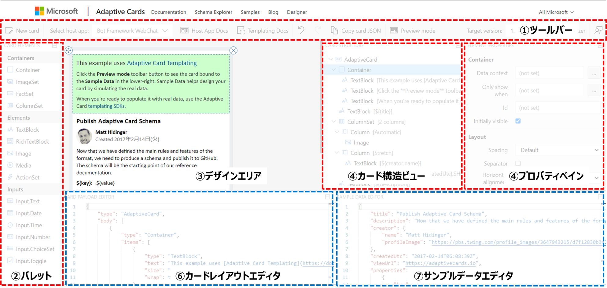

# 2. Adaptive Cards デザイナーの利用

Adaptive Cards を作成するには決められた[スキーマ](https://adaptivecards.io/explorer/) (書式) に沿ってJSONを記述する必要があります。
"JSONを記述する" と言うと身構えてしまうかもしれませんが、Adaptive Cards ではウェブで利用できるデザイナーが用意されており、直接JSONを書くことなく、ドラッグ&ドロップや設定値の入力だけでカードを作成することが可能です。

本章ではAdaptive Cards デザイナーを利用してサンプルのカードをカスタマイズする方法や、空のカードから初めて独自のカードを作成する場合の方法を記載します。

なお、後述するTemplating (カードレイアウトとデータの分離) については本章では触れないこととします。

>**[参考]**
>
>Adaptive Cards デザイナーの他に、"Classic Visualizer"が利用できますが、これは作成したJSONから各サービスでの表示をエミュレートするものです。
>すでに機能としては Adaptive Cards デザイナーに内包されているため、本書では利用しません。
>
>https://adaptivecards.io/visualizer/index.html

## 2-1. Adaptive Cards デザイナーの概要

ウェブブラウザーを起動して、以下のURLを表示しましょう。

https://adaptivecards.io/designer/

読み込みが完了すると下図のような画面が表示されます。これがAdaptive Cards デザイナーです。

デザイナーの画面は大きく7つの要素で構成されています。

### 各部のやくわり


本書では、主に①～⑤を利用してカードを作成していきます。

①パレットからカードで利用するパーツを③デザインエリアにドラッグ＆ドロップし、追加したパーツの設定 (表示文字列や選択肢等) を⑤プロパティペインで指定します。

入力後、①ツールバーにある[Preview mode]ボタンをクリックして表示を確認し、[Copy Card JSON]をクリックするか、⑥カードレイアウトエディタのJSONをコピーして利用します。

**一連の流れを簡単な画像で**


スクショは全部125%全画面で。

## 2-2. カードへのパーツ追加 (In progress)
Adaptive Cards に追加可能なパーツには大きくわけて
- データ表示
- レイアウト
- 入力
- アクション

が提供されています。

それぞれを詳細に理解するためには [スキーマ](https://adaptivecards.io/explorer/) を確認する必要がありますが、ここでは代表的なものについて解説します。

### TextBlock
ラベルや一行・複数行テキスト型のデータを表示する際に利用するのがTextBlockです。

**Text** プロパティに表示する文字列を設定します。この中では部分的にMarkdownによる書式付テキストが有効なため、装飾する場合には [こちらのページ](https://docs.microsoft.com/en-us/adaptive-cards/authoring-cards/text-features) を参照してください。

複数行テキストを表示するには **Wrap** プロパティをチェックします。もし最大行数を設定したい場合には **Maximum lines** に行数を設定してください。

その他、**Style** プロパティではフォントサイズや太さ、カラーを指定できます。

また、最近のアップデートで特殊な書式として
```
<at>user@example.com</at>
```
によるユーザーへのメンションが追加されています。 (Teams限定)


### Image
画像表示用のパーツです。
必須の **Url** プロパティに対してインターネット上の画像URLを指定するだけでなく (画像URLを利用する場合には匿名でのアクセスが前提)、画像のdata uriを設定することでも画像を表示できます。

**Style** を "Person" に設定すると、画像が丸く切り抜かれます。

 Image は画像を表示するだけでなく、アクションを追加することができます。
 例えば画像をクリックしてリンクに遷移するなど、アクション利用して装飾されたカスタムボタンを作ることもできます。

※アクションについては後述

### FactSet
名前からあまりピンとこないかもしれませんが、箇条書きや「設定名 : 設定値」のペアを複数表示するような場合に有効なパーツです。

FactSet には固有の **Facts** というプロパティがあり、 Name - Value のペアを設定します。 いずれも一意である必要はないので、Name に ✓ のような記号を入れて箇条書きにすることもできます。

### Container
Container は複数のパーツを一纏めにするときに有効なパーツです。
背景画像 (**Background image > URL**) を設定できるので、画像の上に文字を表示するような少し凝ったデザインのカードを作成する場合に有効です。

また、生成されるJSONとしても、Container パーツの中 (下位の構造) にパーツを含めることができるので、配列形式のデータを表示する場合も有効です。

### ColumnSet
カードをデザインするときに段組みをしたい場合には、この ColumnSet を使います。

ColumnSet を追加した際には、パーツ右下に表示されるアイコンから、「Add a column」で1つ以上の Column を追加してください。

それぞれの Column には **Layout**プロパティが設定可能で、特に **Width** プロパティを設定することで、任意の割合でカードを分割することができます。

例えば、左側20%にアイコン画像を、右80%に氏名等のプロフィールを書くと、簡単にプロフィールカードを作ることができます。

"RowSet" のような行方向の分割がないので完全ではありませんが、うまく ColumnSet を入れ子にすることで、非常にデザイン性に富んだカードを作成できます。

### Input.Text
入力関連のパーツでは共通して、**Id** プロパティでユーザーの入力情報が取得するため、設定が必須になります。
その他、入力関連のパーツでは、プレースホルダー、デフォルト値等がオプションとして設定できます。

Input.Text に固有の設定としては、複数行テキストを許容するかどうかの **Multi-line** と、最大の文字長を指定する **Maximum length** があります。
どちらもデータを登録・利用するサービスに合わせて設定を行ってください。

### Input.Date
Adaptive Cards でフォームを構成する際によく利用するパーツとして、 **Input.Date** も非常に重要です。

Input.Date を利用するとカレンダーのアイコンクリック時にDate Pickerが表示されるので、ユーザーの入力を制御することができます。

Input.Dateの出力結果は **YYYY-MM-DD** 形式です。

出力だけでなく、**Default/Minimum/Maximum value** の各プロパティはいずれも YYYY-MM-DD 形式で設定します。

### Input.ChoiceSet
ユーザーからの入力を選択肢にしたい場合には **Input.ChoiceSet** を利用します。

単一選択と複数選択がサポートされており、複数にする場合には **Allow multi selection** をチェックします。
また、ドロップダウン形式とラジオボタン形式の表示を **Compact style** プロパティで切り替えます。

選択肢の管理は **Choices** プロパティで行います。
2つの入力、TitleとValue で1つの選択肢が構成されており、**Title はユーザーに表示される文字列** を、 **Value は内部・データ取得で利用する値** をそれぞれ表しています。

§4 で解説するように、**Input.ChoiceSet の選択結果は複数選択でも文字列** で返されます。
例えば "Choice1, Choice2" のように、選択結果はカンマ区切りになる点に注意してください。

### Action.OpenUrl
アクションは以下の3か所から追加可能です。
- ActionSet内
- カードに追加
- Image や Containerなど他パーツ内

アクションを追加するとボタンがカードに表示されます。
**Action.OpenUrl** は設定されたURLを展開するアクションです。

**Url** プロパティは設定必須で、http以外にもmailtoなど、他のURLスキームを利用できます。

また、**Icon URL** プロパティを設定すると、アイコン付きボタンが表示されます。


### Action.Submit (Outlook 以外)
ユーザーの入力を送信する際に利用するのが **Action.Submit** です。
Action.Submit で生成されたボタンをクリックすることで、データが送信されます。

Action.Submit ではユーザーの入力情報以外にも、**Data** プロパティに設定した情報を送信することができます。
以下のような書式で設定してください。
```
{"_hiddenData":"some_value"}
```

データを送信すると他のユーザー入力情報と合わせて一纏まりのオブジェクトとして送られます。
※ここでは Input.Text の Id が "myName" であると仮定しています。
```
{
    "myName":"Hiroaki Nagao",
    "_hiddenData":"some_value"
}
```


### Action.Http (Outlook のみ)
Outlook でユーザーの入力情報を送信するときに利用するのが **Action.Http** です。

利用方法については§4-x で解説します。任意のURLにデータを送信できるので、Power Automate から利用する場合には Teams よりも柔軟にデータを取りまわせます。

以上で簡単ですが、Adaptive Cards Designer の解説は終わりです。

## 2-4. 練習問題
下図のようなカードをデザイナーで作成してみましょう。

解答はGithubの以下のURLに配置しています。
