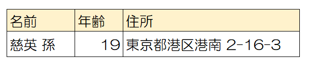
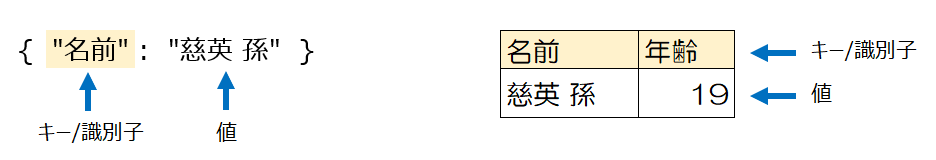
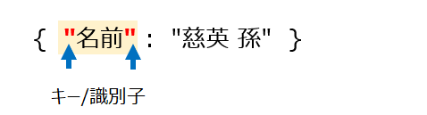
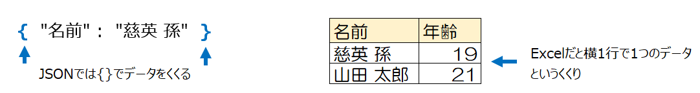

# JSONと仲良くなるために

# はじめに
JSON、最近よくみる単語ですね。バリバリの開発をやっているわけではなくても、『データをやり取りする』みたいな文脈ではよく見るのではないでしょうか。
また、ローコードの分野でも、「これを知らないと何もできない！」というほどではありませんが、知っておくとより便利に使えることに違いはありません。
一方で、JSONという言葉を聞いただけで拒否反応が出てしまう人がいることも事実です。「何かよくわからないもの」「コード」「いっぱい文字が書かれている何か」という具合です。

今回は、そんな「仲良くなれるといいことあるけど、なかなか近寄れないヤツ」なJSONと仲良くなるための手助けになるかもしれない投稿です。
これを読んだ後に、少しはJSONに抵抗がなくなっていただけたらうれしいです。


# さて、JSONとは？

JSONはデータを記述するルール(形式)の1つです。
そういう意味で、CSVやXMLと同じようなモノと言えます。
CSVはExeclで開けるくらいなので、凡そどんなものか皆さん理解しているのではないでしょうか。またXMLも、「HTMLみたいなもの」と一定の理解をされている場合があるのかなと思います。
一方でJSONです。これはなかなか身近な対応物がないので理解しづらく、それゆえに抵抗がでるのではと思います。私も、読めないからわからないで大分長いこと距離をとってきました。
でもJSONもCSVやXMLと同様、データを記述するルールの1つなので、ルールさえ理解すれば読み書きできるようになります。

以下では、JSONのサンプルから初めて、そのルール、書き方・読み方を図を交えて解説していきます。

## JSONのサンプル
まずは簡単なJSONのサンプルを見てみましょう。これを見ただけでクラッときたら、たぶんJSONが苦手です。
```
{
    "名前": "慈衛 孫",
    "年齢": 19,
    "住所": "東京都港区港南 2-16-3"
}
```

では以下の図ではどうでしょうか？



この2つ、表現が異なるだけで、表していることは同じです。
下の図を見れば「名前は慈英 孫で、年齢は19歳、住所は東京都港区港南～だな」と予想できると思います。
繰り返しになりますが、JSONはあくまでもデータの表し方の1つなので、よく知っている表記に直してあげれば、決して全然理解できないものではないのです。

以降、ルールや書き方・読み方を解説する中で、しばしばこの「Excelの表での表現」で慣れていければと思います。

# JSONの書式ルール

HTMLやCSVも一定のルールがあるように、JSONも書くときのルールがあります。
先ほどのJSONのサンプル見て、以下の点に気付くでしょう。

1. 最初と最後に{ } がついている
2. : がどの行にも入っている
3. 行の終わりには , が入っている
4. 各行の : で区切られた前方は、必ず " "で囲まれている

これのどれもがJSONの書式ルールです。このセクションではJSONの書式ルールについて解説します。

## ルール1. キーまたは識別子 と 値 の組み合わせで構成される

よく「複数のキー・バリューから構成されます」という説明を見ますが、これがそもそもわからないですよね。

JSONはデータを表す表現なので、データ（数値）だけあってもダメで、それがどういう意味なのか/何を表しているのかが必要になります。
この『何を表しているか』が**キー/識別子**です。

ここでもExcelの表を使ってみると、Excel表の列名にあたる部分がJSONでのキー/識別子と思えます。一方でその列の値が（そのままですが）**値**です。
JSONが複数のキーと値から構成されているというのは、非常に粗く言えば複数の列があるExcel表です というのと変わらないです。
データを表すための識別子 と 値のセットで表現していますよ ということです。


## ルール2. キー/識別子 は ダブルクォーテーションで囲む
これはそのままです。キー/識別子 は**必ず** ダブルクォーテーションで囲みましょう。シングルクォーテーションやダブルクォーテーションなしではエラーになります。
ルール1と2を合わせると以下のような表現です。

```
"キー" : 値
```

『あれ？サンプルだと値もダブルクォーテーションで囲まれているじゃない？』と思われるかもしれません。これはすこし意味合いが違って、データ型の話題で触れたいと思います。



## ルール3. 最初と最後は中カッコ {...} でくくる

どこからどこまでが 1つのデータ (Excel表でいうところの1行) なのかを表すために 最初と最後を中カッコ{}でくくります。
Excel表では多くの場合、改行がデータの区切りですがJSONでは{}だ ということです。



参考：

https://www.codewall.co.uk/the-complete-json-tutorial-quickly-learn-json/

https://www.sejuku.net/blog/80617
